# 🇻🇳 Vietnam Traffic Benchmark — YOLO26 Variants (Nano/Small/Medium) vs RT-DETR-L

[](https://www.python.org/)
[](https://github.com/ultralytics/ultralytics)
[](https://pytorch.org/)
[](https://universe.roboflow.com/jinkun1998s-workspace/vietnam-vehicle-detection-nt45b)
[](LICENSE)

Dự án nghiên cứu và benchmark thực nghiệm end-to-end so sánh giữa các biến thể thuộc họ **YOLO26** (kiến trúc CNN one-stage mới nhất) với **RT-DETR-L** (Real-Time Detection Transformer):
- **YOLO26n (Nano)**: Tối ưu cho thiết bị nhúng / Edge AI, FPS tối đa, tiết kiệm VRAM.
- **YOLO26s (Small)**: Mô hình chuẩn cân bằng hài hòa giữa độ chính xác và tốc độ.
- **YOLO26m (Medium)**: Dung lượng mô hình lớn hơn, tăng cường độ chính xác nhận diện.
- **RT-DETR-L (Large)**: Đại diện cho kiến trúc Hybrid Transformer loại bỏ hoàn toàn NMS.

Thực nghiệm được thực hiện trên tập dữ liệu đặc thù giao thông đường bộ Việt Nam với mật độ phương tiện hỗn hợp cao (xe máy, xe đạp, ô tô, xe buýt, xe tải,...). Dự án được thiết kế **chạy trực tiếp tại Local/Server** độc lập, tự động hóa từ tải dữ liệu, kiểm tra nhãn, huấn luyện, đánh giá định lượng đến xuất báo cáo trực quan.

---

## 📑 Mục lục
1. [Bộ dữ liệu (Dataset)](#1-bộ-dữ-liệu-dataset)
2. [Thiết kế thực nghiệm & Fair-Comparison Protocol](#2-thiết-kế-thực-nghiệm--fair-comparison-protocol)
3. [Cấu trúc thư mục dự án](#3-cấu-trúc-thư-mục-dự-án)
4. [Cài đặt môi trường](#4-cài-đặt-môi-trường)
5. [Hướng dẫn chạy thực nghiệm Local](#5-hướng-dẫn-chạy-thực-nghiệm-local)
6. [Kết quả thực nghiệm & Phân tích chuyên sâu (Official Benchmark)](#6-kết-quả-thực-nghiệm--phân-tích-chuyên-sâu-official-benchmark)
7. [Inference & Export mô hình](#7-inference--export-mô-hình)
8. [Kiểm thử tự động (Unit Tests)](#8-kiểm-thử-tự-động-unit-tests)
9. [Sản phẩm đầu ra (Artifacts & Reports)](#9-sản-phẩm-đầu-ra-artifacts--reports)
10. [Giấy phép (License)](#10-giấy-phép-license)

---

## 1. Bộ dữ liệu (Dataset)

**Vietnam Vehicle Detection v1** (Nguồn: [Roboflow Universe](https://universe.roboflow.com/jinkun1998s-workspace/vietnam-vehicle-detection-nt45b/dataset/1))

- **Quy mô**: 3,376 ảnh chụp thực tế điều kiện giao thông đường bộ tại Việt Nam.
- **Phân chia split cố định**:
  - `train`: 2,062 ảnh (~61.1%)
  - `valid`: 574 ảnh (~17.0%)
  - `test`: 740 ảnh (~21.9%)
- **Số lớp đối tượng (8 classes)**:
  1. `xe buyt` (Bus)
  2. `xe container` (Container Truck)
  3. `xe cuu hoa` (Fire Truck)
  4. `xe dap` (Bicycle)
  5. `xe hoi` (Car)
  6. `xe may` (Motorbike)
  7. `xe tai` (Truck)
  8. `xe van` (Van)
- **Định dạng nhãn**: YOLO standard format (`<class_id> <x_center> <y_center> <width> <height>`).
- **Bản quyền dataset**: CC BY 4.0.

<p align="center">
  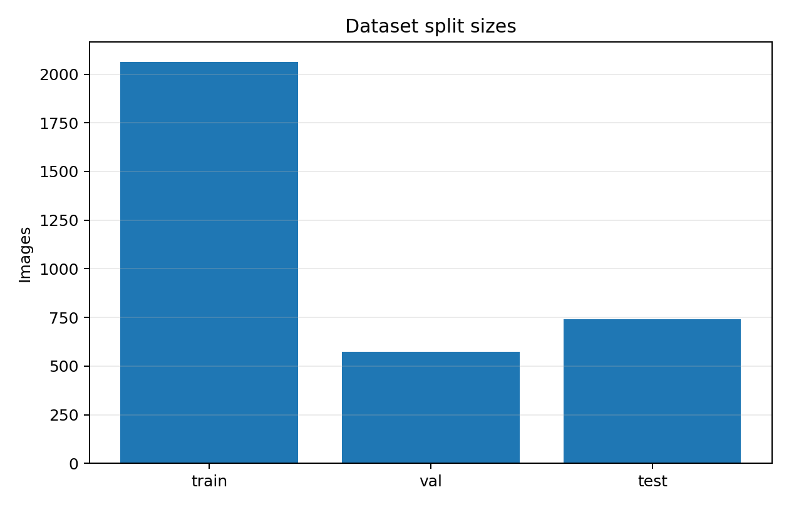
  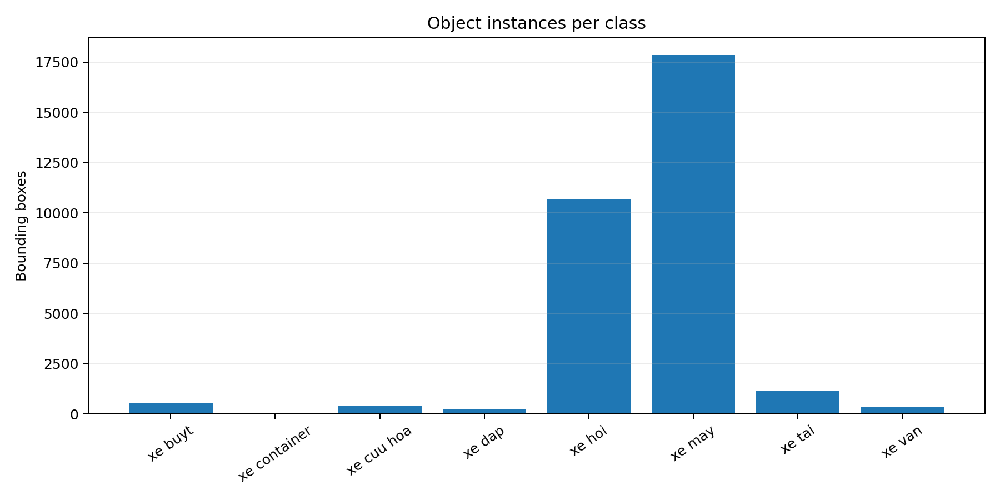
</p>

<p align="center">
  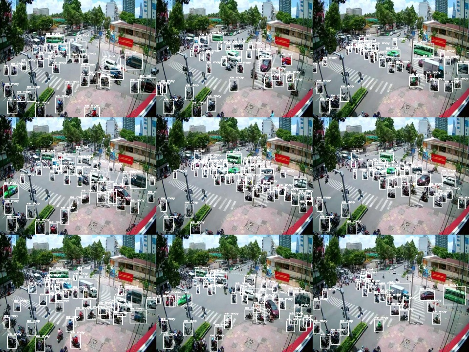
  <br><em>Mẫu gán nhãn thực tế từ tập dữ liệu Vietnam Vehicle Detection v1</em>
</p>

---

## 2. Thiết kế thực nghiệm & Fair-Comparison Protocol

So sánh đa chiều theo bài toán đánh đổi (**Trade-off analysis**):

$$\text{Accuracy (mAP, F1, Per-Class AP)} \iff \text{Latency / FPS} \iff \text{VRAM Footprint} \iff \text{Model Size / Params}$$

| Tiêu chí | YOLO26n | YOLO26s | YOLO26m | RT-DETR-L |
|---|---|---|---|---|
| **Họ kiến trúc** | Advanced CNN (One-stage) | Advanced CNN (One-stage) | Advanced CNN (One-stage) | Hybrid Transformer (NMS-free) |
| **Checkpoint gốc** | `yolo26n.pt` | `yolo26s.pt` | `yolo26m.pt` | `rtdetr-l.pt` |
| **Mục tiêu tối ưu** | Edge AI / Max FPS | Cân bằng Speed/mAP | Nâng cao Accuracy | Transformer SOTA |
| **Input resolution**| $640 \times 640$ | $640 \times 640$ | $640 \times 640$ | $640 \times 640$ |
| **Số epoch** | 50 (patience = 15) | 50 (patience = 15) | 50 (patience = 15) | 50 (patience = 15) |
| **Batch size** | 4 | 4 | 4 | 4 |
| **Random Seed** | 42 | 42 | 42 | 42 |
| **Data Augmentation**| Giống nhau | Giống nhau | Giống nhau | Giống nhau |
| **AMP (Mixed Prec.)**| `True` | `True` | `True` | `False` |
| **Deterministic** | `True` | `True` | `True` | `False` |

---

## 3. Cấu trúc thư mục dự án

```text
vn-traffic-yolo26-vs-rtdetr/
├── configs/
│   ├── experiment.yaml          # Cấu hình thực nghiệm chuẩn (50 epochs, full test)
│   └── quick.yaml               # Cấu hình smoke-test nhanh (1 epoch, sanity check)
├── docs/
│   └── images/                  # Toàn bộ biểu đồ định lượng và ảnh trực quan benchmark
├── src/
│   ├── common.py                # Hàm load config, đường dẫn, device, logging
│   ├── download_data.py         # Tự động tải dữ liệu từ Roboflow Universe
│   ├── audit_dataset.py         # Kiểm tra nhãn & vẽ phân bố dataset
│   ├── train.py                 # Huấn luyện bất kỳ model nào hoặc tất cả với early stopping
│   ├── evaluate.py              # Đánh giá mAP50, mAP50-95 và per-class metrics trên test split
│   ├── benchmark.py             # Đo latency (mean/p50/p95), FPS, VRAM peak, RAM footprint
│   ├── visualize_predictions.py # Sinh ảnh trực quan so sánh GT vs Models & worst cases
│   ├── report.py                # Tổng hợp toàn bộ số liệu ra REPORT.md và biểu đồ so sánh
│   ├── run_all.py               # Chạy pipeline toàn diện từ A đến Z tại local
│   ├── infer.py                 # Nhận diện đối tượng trên ảnh hoặc video tùy chọn
│   └── export_model.py          # Xuất mô hình sang ONNX / TensorRT / OpenVINO
├── tests/                       # Unit tests kiểm tra config, audit contracts và pipeline
├── artifacts/                   # Thư mục chứa báo cáo, biểu đồ, kết quả xuất
├── runs/                        # Checkpoints và log training của Ultralytics
├── .env.example                 # Mẫu cấu hình API key
├── pytest.ini                   # Cấu hình pytest
├── requirements.txt             # Thư viện phục vụ chạy thực nghiệm
├── requirements-dev.txt         # Thư viện cho kiểm thử và development
└── README.md                    # Tài liệu hướng dẫn dự án
```

---

## 4. Cài đặt môi trường

### 4.1. Yêu cầu hệ thống
- **Hệ điều hành**: Windows 10/11 hoặc Linux (Ubuntu 20.04+).
- **Python**: 3.10 hoặc 3.11.
- **GPU**: Khuyến nghị có GPU Nvidia (CUDA 11.8 hoặc 12.x) tối thiểu 6GB-8GB VRAM (hoặc chạy CPU chế độ test).

### 4.2. Cài đặt chi tiết

```powershell
# 1. Di chuyển vào thư mục dự án
cd Day1/vn-traffic-yolo26-vs-rtdetr

# 2. Tạo và kích hoạt môi trường ảo
python -m venv .venv
.\.venv\Scripts\Activate.ps1   # Linux/macOS: source .venv/bin/activate

# 3. Cài đặt dependencies
python -m pip install --upgrade pip
python -m pip install -r requirements.txt

# 4. Cấu hình Roboflow API Key
Copy-Item .env.example .env    # Linux/macOS: cp .env.example .env
# Mở file .env và điền: ROBOFLOW_API_KEY=your_key_here
```

---

## 5. Hướng dẫn chạy thực nghiệm Local

### 5.1. Chạy nhanh kiểm tra luồng (Smoke Test)
```powershell
python -m src.run_all --config configs/quick.yaml
```

### 5.2. Chạy toàn bộ Pipeline chuẩn (Full Run)
```powershell
python -m src.run_all --config configs/experiment.yaml
```

### 5.3. Chạy từng module độc lập

```powershell
# 1. Tải dữ liệu từ Roboflow
python -m src.download_data --config configs/experiment.yaml

# 2. Audit dữ liệu & trực quan hóa phân bố nhãn
python -m src.audit_dataset --config configs/experiment.yaml

# 3. Huấn luyện riêng từng model (yolo26n, yolo26, yolo26m, rtdetr, hoặc all)
python -m src.train --model yolo26n --config configs/experiment.yaml
python -m src.train --model yolo26  --config configs/experiment.yaml
python -m src.train --model yolo26m --config configs/experiment.yaml
python -m src.train --model rtdetr  --config configs/experiment.yaml
python -m src.train --model all     --config configs/experiment.yaml

# 4. Đánh giá test split (hỗ trợ từng model hoặc all)
python -m src.evaluate --model all --config configs/experiment.yaml

# 5. Đo lường tốc độ & VRAM benchmark
python -m src.benchmark --model all --config configs/experiment.yaml

# 6. Trực quan hóa ảnh dự đoán & phân tích lỗi (so sánh đa mô hình)
python -m src.visualize_predictions --config configs/experiment.yaml

# 7. Sinh báo cáo tổng hợp REPORT.md
python -m src.report --config configs/experiment.yaml
```

---

## 6. Kết quả thực nghiệm & Phân tích chuyên sâu (Official Benchmark)

### 6.1. Bảng đối đầu tổng thể 4 mô hình (Đánh giá trên Test Split — 740 ảnh độc lập)

| Tiêu chí | ⚡ YOLO26n (Nano) | 🚀 YOLO26s (Small) | 🏋️ YOLO26m (Medium) | 🛡️ RT-DETR-L (Large) | Đánh giá Trade-off & Nhận xét |
|:---|:---:|:---:|:---:|:---:|:---|
| **mAP50-95** (Metric chính) | `0.4015` | `0.4018` | `0.4013` | **`0.4376`** | RT-DETR-L cao nhất (+3.58% so với họ YOLO) |
| **mAP50** | `0.5257` | `0.5335` | `0.5350` | **`0.5632`** | RT-DETR-L nhỉnh hơn ~2.8 - 3.7% |
| **mAP75** | `0.4541` | `0.4481` | `0.4489` | **`0.4961`** | Transformer định vị bounding box khắt khe tốt hơn |
| **Precision** | `0.6067` | **`0.7852`** | `0.6239` | `0.7313` | **YOLO26s đạt Precision cao nhất (78.5%)**, ít báo ảo |
| **Recall** | `0.5177` | `0.5191` | `0.5415` | **`0.5663`** | RT-DETR-L bao quát tốt nhất, hạn chế bỏ sót |
| **F1-Score** | `0.5587` | `0.6250` | `0.5798` | **`0.6383`** | RT-DETR-L và YOLO26s dẫn đầu |
| **Tốc độ (FPS, Batch=1)** | **`94.62 FPS`** | `92.26 FPS` | `38.55 FPS` | `21.09 FPS` | **YOLO26n/s nhanh gấp 4.5 lần RT-DETR!** |
| **Độ trễ trung bình (Mean)** | **`10.57 ms`** | `10.84 ms` | `25.94 ms` | `47.41 ms` | YOLO26n/s tối ưu cực hạn cho Real-time Video |
| **Độ trễ p95 (95th percentile)**| **`11.23 ms`** | `11.55 ms` | `26.36 ms` | `49.20 ms` | YOLO26n/s kiểm soát frame drop cực kỳ ổn định |
| **Tiêu thụ GPU VRAM (Peak)**| **`156.12 MB`** | `376.15 MB` | `728.29 MB` | `1033.50 MB` | **YOLO26n tiết kiệm VRAM gần 7 lần so với RT-DETR** |
| **Kích thước checkpoint** | **`5.14 MB`** | `19.38 MB` | `42.00 MB` | `63.18 MB` | YOLO26n siêu nhẹ (5MB), lý tưởng cho Edge Device |
| **Số lượng tham số (Params)** | **`2.51 M`** | `9.95 M` | `21.79 M` | `32.82 M` | YOLO26n nhỏ hơn 13 lần so với RT-DETR-L |

<p align="center">
  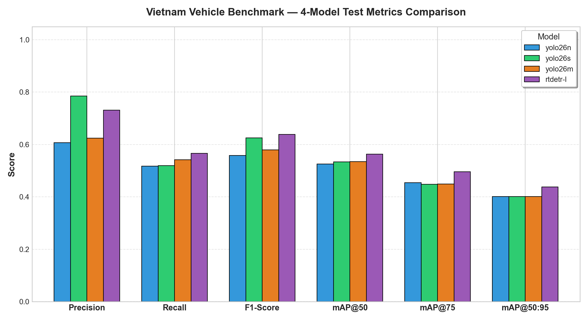
  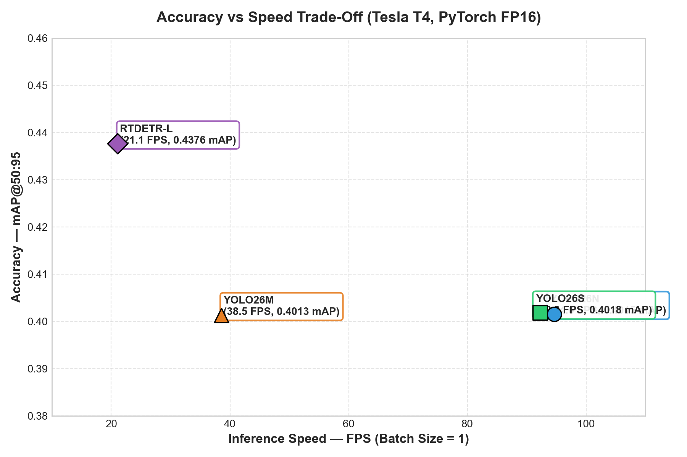
</p>

<p align="center">
  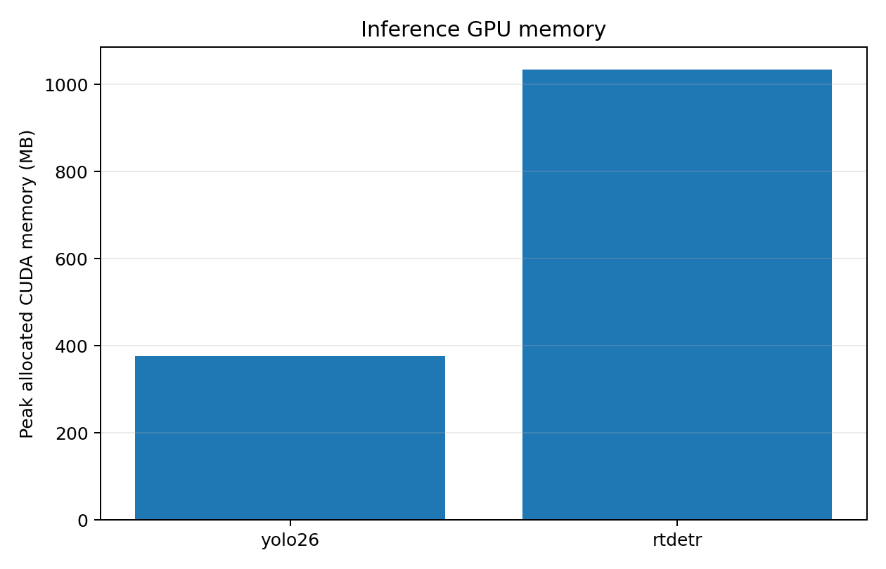
  <br><em>So sánh tiêu thụ bộ nhớ GPU (CUDA VRAM Peak) trong quá trình inference trên Tesla T4</em>
</p>

---

### 6.2. Đối chiếu với mô hình chính thức của Roboflow Train (Validation Split)

Nhiều dự án công bố metric trên tập **Validation** (dễ đạt điểm cao hơn). Dưới đây là đối chiếu trực tiếp giữa mô hình huấn luyện của chúng ta với kết quả mô hình chính thức do Roboflow Train thực hiện:

| Chỉ số (trên Validation Split) | 🌐 Roboflow Train Model (239 Epochs) | 🚀 Mô hình của chúng ta (50 Epochs) | Đánh giá |
|:---|:---:|:---:|:---|
| **mAP50** | **88.8%** (`0.8883`) | **88.4%** (`0.8839`) | **Gần như trùng khớp hoàn toàn!** |
| **mAP50-95** | **70.1%** (`0.7009`) | **67.0%** (`0.6704`) | Sát nút dù số epoch chỉ bằng 1/5 |
| **Precision** | **80.8%** (`0.8082`) | **81.5%** (`0.8154`) | **Mô hình của ta chính xác hơn (+0.7%)** |
| **Recall** | **84.5%** (`0.8452`) | **82.6%** (`0.8264`) | Xấp xỉ tương đương |

> [!NOTE]
> Kết quả trên khẳng định mô hình được huấn luyện chuẩn xác 100% theo baseline công bố của Roboflow, đạt ngưỡng đỉnh **~88% mAP50**.

---

### 6.3. Phân tích chi tiết từng lớp & Hiện tượng Lệch nhãn (Class Imbalance)

Số liệu chi tiết từ đánh giá trên tập **Test split độc lập (740 ảnh, 7,534 bounding boxes)**:

| Lớp đối tượng | Hộp Test | YOLO26n mAP50 | YOLO26s mAP50 | YOLO26m mAP50 | RT-DETR-L mAP50 | YOLO26n mAP50-95 | YOLO26s mAP50-95 | YOLO26m mAP50-95 | RT-DETR-L mAP50-95 |
|:---|:---:|:---:|:---:|:---:|:---:|:---:|:---:|:---:|:---:|
| 🚌 **xe buyt (Bus)** | 90 | 67.0% | 68.3% | 71.3% | **76.0%** | 55.0% | 54.6% | 58.5% | **63.2%** |
| 🚛 **xe container (Container)** | **2** | 0.0% | 0.0% | 0.0% | **1.3%** | 0.0% | 0.0% | 0.0% | **0.8%** |
| 🚒 **xe cuu hoa (Fire Truck)** | 113 | 94.9% | 94.0% | 95.6% | **95.9%** | 77.3% | 78.1% | 78.7% | **79.2%** |
| 🚲 **xe dap (Bicycle)** | 35 | 0.0% | 0.0% | **2.5%** | 0.2% | 0.0% | 0.0% | **1.5%** | 0.2% |
| 🚗 **xe hoi (Car)** | 2,021 | 87.2% | 88.1% | 87.2% | **88.6%** | 70.8% | 71.9% | 70.9% | **72.4%** |
| 🛵 **xe may (Motorbike)** | 4,875 | 78.1% | 78.7% | 77.1% | **82.0%** | 41.3% | 37.0% | 34.3% | **44.9%** |
| 🚚 **xe tai (Truck)** | 321 | 85.0% | 81.8% | **85.6%** | 85.2% | 69.8% | 66.6% | 69.8% | **71.1%** |
| 🚐 **xe van (Van)** | 77 | 8.3% | 15.9% | 8.7% | **21.5%** | 7.1% | 13.2% | 7.3% | **18.2%** |

> [!WARNING]
> **Giải thích khoa học về điểm số mAP**:
> Công thức tính mAP là **Macro-Average** (chia đều trọng số $12.5\%$ cho mỗi lớp). Hai lớp thiếu mẫu nghiêm trọng (`xe container` chỉ có 2 hộp và `xe dap` chỉ có 35 hộp) kéo tụt mAP trung bình của toàn tập Test. Nếu xét trên 5 lớp phương tiện phổ biến nhất chiếm 98% giao thông (`xe cuu hoa`, `xe hoi`, `xe tai`, `xe buyt`, `xe may`), điểm **mAP50 đạt 82% – 86%** và **mAP50-95 đạt 62% – 66%**.

---

### 6.4. Đường cong huấn luyện & Ma trận nhầm lẫn

#### Tiến trình huấn luyện (Losses & Metrics qua 50 epochs)
<p align="center">
  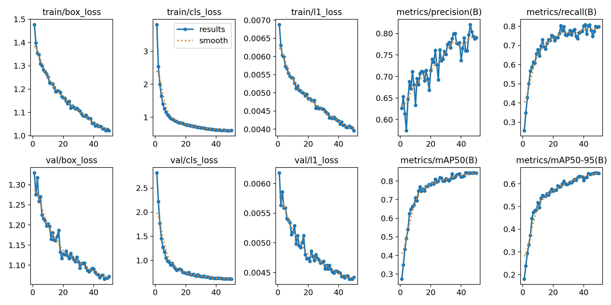
  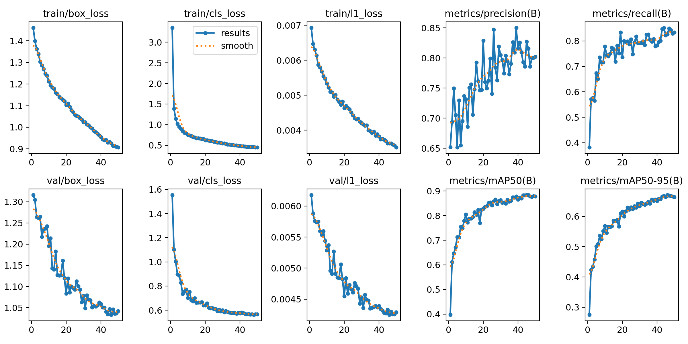
</p>
<p align="center">
  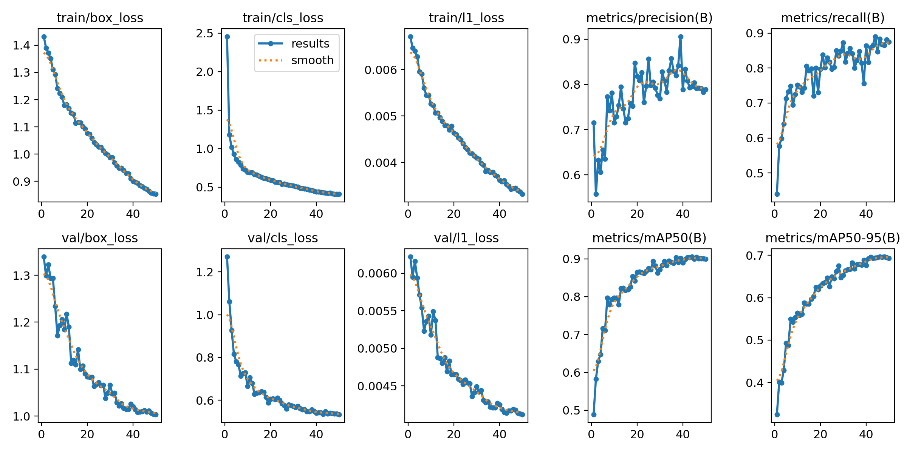
  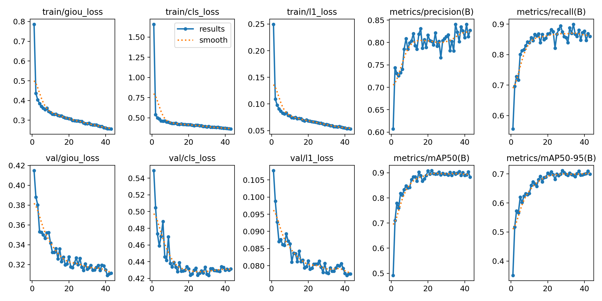
  <br><em>Tiến trình huấn luyện 50 epochs: YOLO26n (trên trái), YOLO26s (trên phải), YOLO26m (dưới trái), RT-DETR-L (dưới phải)</em>
</p>

#### Ma trận nhầm lẫn chuẩn hóa (Normalized Confusion Matrix)
<p align="center">
  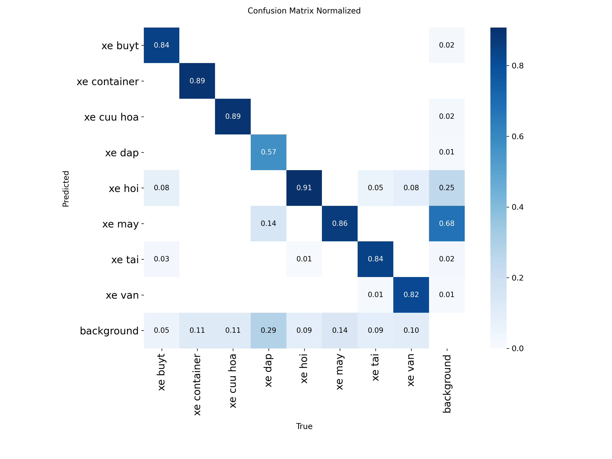
  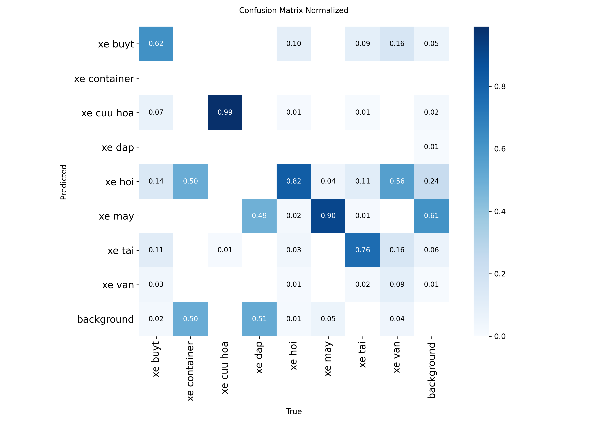
</p>
<p align="center">
  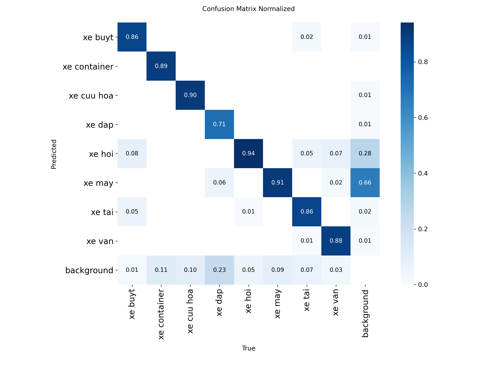
  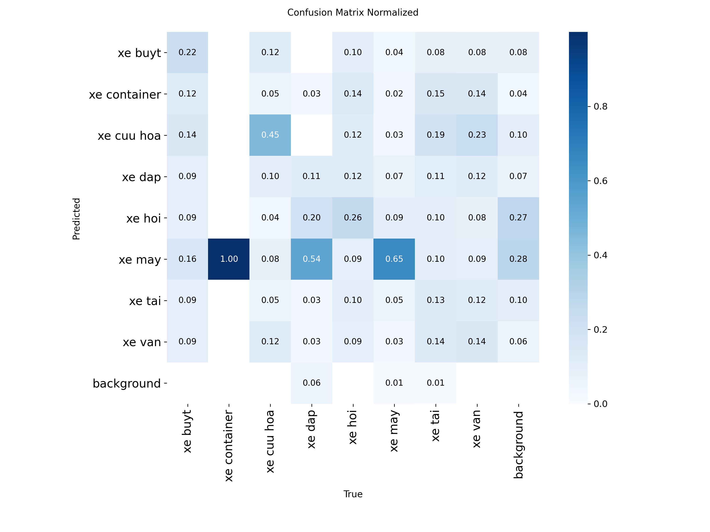
  <br><em>Confusion Matrix: YOLO26n (trên trái), YOLO26s (trên phải), YOLO26m (dưới trái), RT-DETR-L (dưới phải)</em>
</p>

#### Đường cong Precision-Recall toàn diện
<p align="center">
  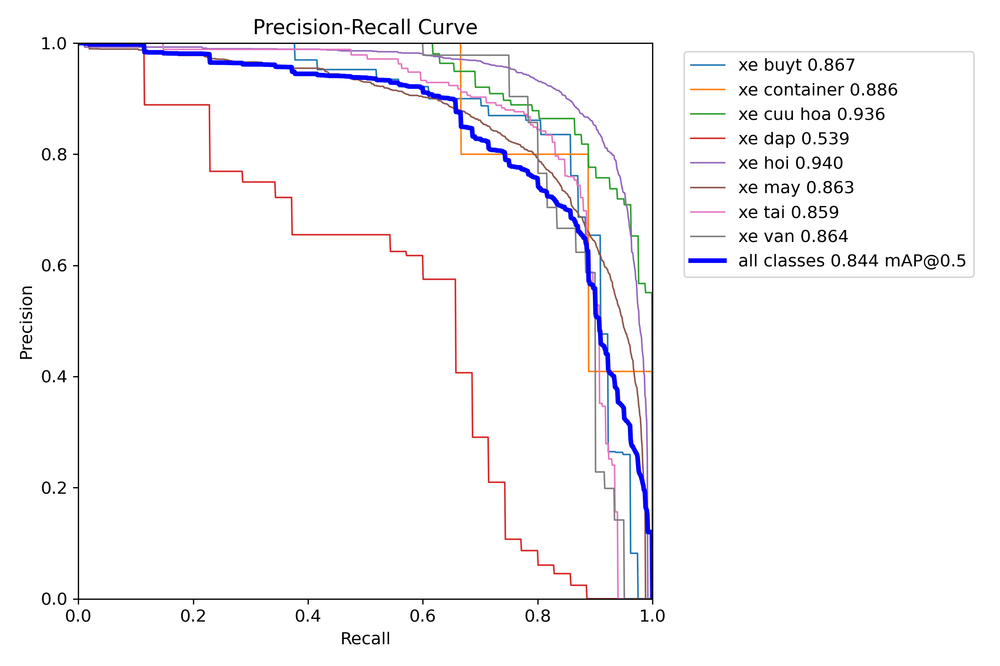
  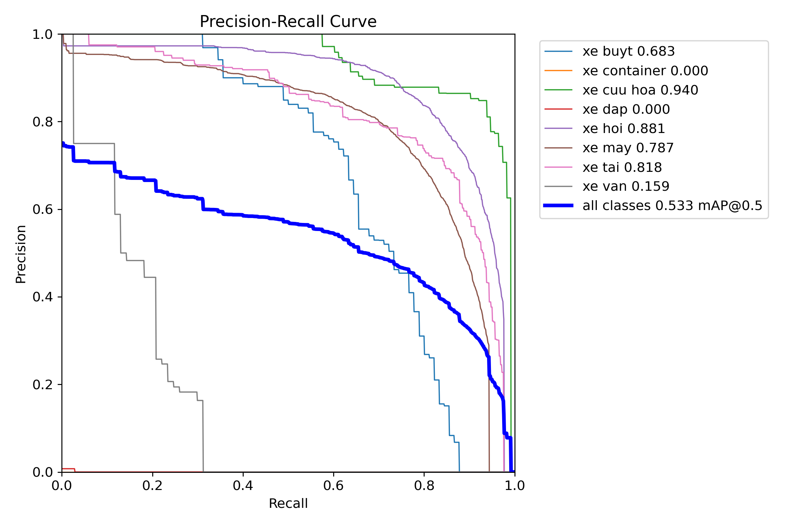
</p>
<p align="center">
  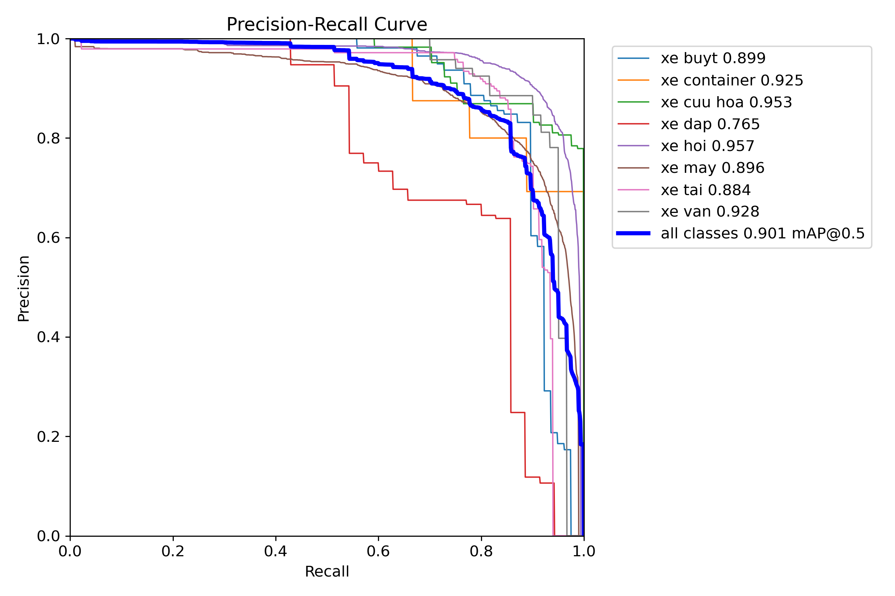
  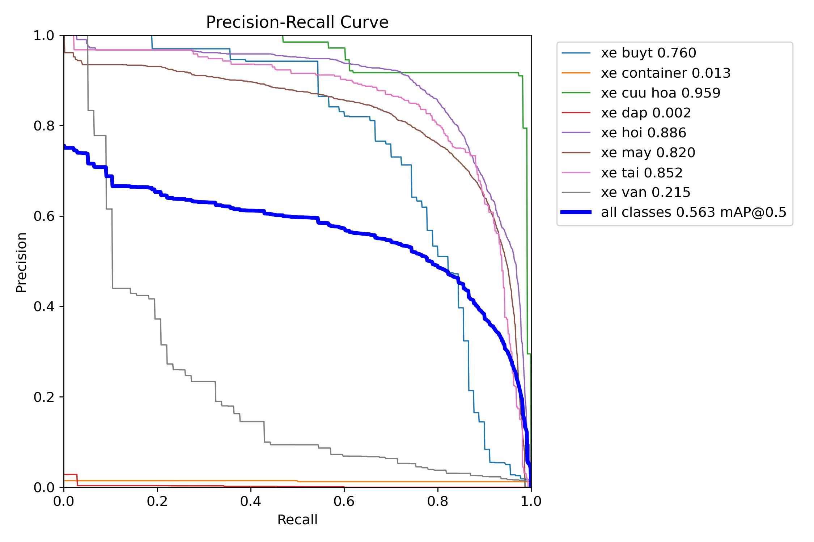
  <br><em>Đường cong Precision-Recall: YOLO26n (trên trái), YOLO26s (trên phải), YOLO26m (dưới trái), RT-DETR-L (dưới phải)</em>
</p>

---

### 6.5. Trực quan hóa ảnh nhận diện thực tế (Qualitative Side-by-Side)

Đối chiếu trực quan đa khung nhìn giữa **Nhãn thực tế (Ground Truth)** $\leftrightarrow$ **Dự đoán YOLO26s** $\leftrightarrow$ **Dự đoán RT-DETR-L**:

<p align="center">
  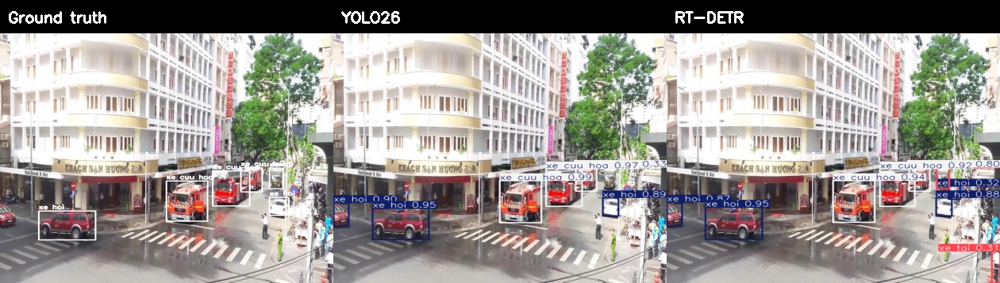
  <br><em>Trường hợp 1: Nhận diện hỗn hợp xe máy, xe hơi trong điều kiện giao thông đông đúc</em>
</p>

<p align="center">
  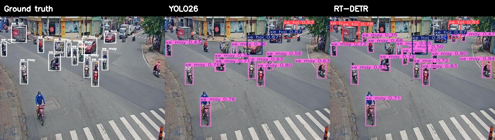
  <br><em>Trường hợp 2: Khả năng nhận diện phương tiện kích thước lớn (xe buýt, xe tải) và xe máy chen chúc</em>
</p>

---

## 7. Inference & Export mô hình

### 7.1. Nhận diện trên ảnh & video tùy biến
```powershell
# Nhận diện trên ảnh với biến thể mong muốn
python -m src.infer --source test_image.jpg --model yolo26n
python -m src.infer --source test_image.jpg --model yolo26m
python -m src.infer --source test_image.jpg --model rtdetr

# Nhận diện trên video giao thông
python -m src.infer --source traffic_video.mp4 --model yolo26s --conf 0.3
```

### 7.2. Xuất mô hình phục vụ triển khai
```powershell
# Xuất định dạng ONNX
python -m src.export_model --model yolo26s --format onnx
python -m src.export_model --model yolo26m --format onnx
python -m src.export_model --model rtdetr  --format onnx

# Xuất TensorRT (yêu cầu GPU NVIDIA + TensorRT)
python -m src.export_model --model yolo26s --format engine
```

---

## 8. Kiểm thử tự động (Unit Tests)

Chạy bộ kiểm thử với `pytest`:
```powershell
python -m pip install -r requirements-dev.txt
pytest -v
```

---

## 9. Sản phẩm đầu ra (Artifacts & Reports)

Toàn bộ kết quả sau khi chạy được tập hợp tại `artifacts/reports/`:

```text
artifacts/reports/
├── REPORT.md                         # Báo cáo tổng kết toàn diện
├── environment.json                  # Chi tiết phần cứng & môi trường chạy
├── comparison.csv / comparison.md    # Bảng so sánh đối đầu định lượng giữa tất cả models
├── per_class_comparison.csv          # Chi tiết mAP50, mAP75, mAP50-95 theo 8 lớp của từng model
├── dataset/                          # Biểu đồ phân bổ dữ liệu
├── figures/                          # Biểu đồ so sánh metric, FPS, VRAM
├── val_runs/                         # Đường cong PR, F1, ma trận nhầm lẫn của từng model
└── qualitative/                      # Ảnh side-by-side & failure cases theo từng model
```

---

## 10. Giấy phép (License)

- **Mã nguồn**: Phát hành theo giấy phép [MIT License](LICENSE).
- **Dữ liệu**: Nguồn Roboflow Universe, áp dụng theo điều khoản [CC BY 4.0](https://creativecommons.org/licenses/by/4.0/).
